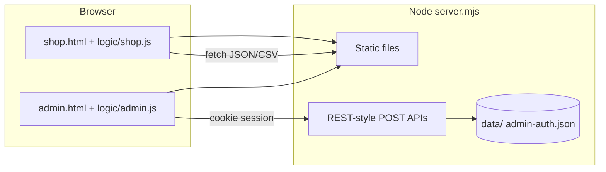

# Marketpl — filesystem & architecture

A small **static storefront** (HTML/CSS/JS) with a **local Node.js server** that serves files and persists JSON/CSV data. The shop loads copy and products over HTTP; **do not open `shop.html` via `file://`** — use the server.

---

## Directory layout

```
marketpl/
├── index.html              # Redirects to shop.html
├── shop.html               # Storefront (markup only; assets linked below)
├── admin.html              # Seller admin UI (markup only)
├── server.mjs              # HTTP server + API + static files
├── package.json            # { "scripts": { "start": "node server.mjs" } }
├── admin-auth.json         # Login secrets (gitignored — see .gitignore)
├── .gitignore              # Ignores admin-auth.json
├── ARCHITECTURE.md         # This file
│
├── style/
│   ├── shop.css            # Store styles
│   └── admin.css           # Admin styles
├── logic/
│   ├── shop.js             # Store behaviour (cart, checkout, CSV, context)
│   └── admin.js            # Admin forms, save to API
│
├── data/
│   ├── context.json        # Store copy, WhatsApp, hero, footer, csv_url, …
│   ├── products.csv        # Product catalog (Papa Parse)
│   └── orders.csv          # Order line items (checkout appends; admin may rewrite whole file; not served over HTTP)
├── assets/                 # Product/hero images (paths like assets/photo.jpg)
│
└── bakup/                  # Old snapshots — not wired into the app
```

---

## High-level architecture



- **Shop** is public: anyone can load pages and `GET` `data/context.json` and `data/products.csv`.
- **Writes** (`POST /api/save-context`, `/api/save-products`, order **advance** / **delete**) require an **admin session cookie** set after login. **`GET /api/admin/orders`** also requires a session.
- **Admin auth** is stored in `admin-auth.json` (password hash, session secret, dev reset key). First run creates this file; see server console output.

---

## Runtime: how to run

```bash
npm start
# Serves on http://127.0.0.1:8787 (override with PORT=...)
```

- **Store:** `http://127.0.0.1:8787/shop.html` (or `/` → `shop.html`)
- **Admin:** `http://127.0.0.1:8787/admin.html`

The server listens on **`0.0.0.0`**, so other devices on the same LAN can use your machine’s IPv4 address (printed on startup). You may need to allow **Node** or **TCP port 8787** through Windows Firewall for private networks.

---

## `server.mjs` responsibilities

| Concern | Details |
|--------|---------|
| **Static hosting** | Serves the project root: HTML, `style/*`, `logic/*`, `data/*`, `assets/*`. |
| **Path safety** | Resolves paths under the project directory; blocks direct HTTP `GET` of **`admin-auth.json`** and **`data/orders.csv`** (same basename rule as static files). |
| **Data writes** | **`data/context.json`** and **`data/products.csv`**: resilient writes (temp file + rename + retries on Windows `EBUSY`). **`data/orders.csv`**: checkout **`POST /api/log-order`** appends lines; admin **advance** / **delete** rewrites the file via the same resilient helper. |
| **Orders logic** | Parses CSV rows, migrates legacy files without `status`, groups line items by `order_id`, and tolerates some broken spreadsheet exports (continuation rows + plausible id heuristics — see `data/orders.csv` below). |
| **Admin API** | Login, logout, session check, change password, **developer reset** (dev key or `ADMIN_DEV_KEY` env), **orders** list / advance / delete. |
| **CORS** | `Access-Control-Allow-Origin: *` — fine for same-origin use; be careful if you proxy cross-origin. |

### API summary (same origin; admin uses `credentials: 'include'`)

| Method | Path | Auth | Purpose |
|--------|------|------|---------|
| `GET` | `/api/admin/status` | — | `{ loggedIn, phoneConfigured, phoneHint }` |
| `POST` | `/api/admin/login` | — | Body: `{ phone, password }` (digits-only phone) |
| `POST` | `/api/admin/logout` | — | Clears session cookie |
| `POST` | `/api/admin/change-password` | session | `{ oldPassword, newPassword }` |
| `POST` | `/api/admin/dev-reset` | dev key | `{ devKey, newPassword, newPhone? }` — resets password (and optionally phone) |
| `POST` | `/api/save-context` | session | Full JSON → `data/context.json` |
| `POST` | `/api/save-products` | session | `{ csv: "..." }` → `data/products.csv` |
| `GET` | `/api/admin/orders` | session | `{ ok, orders[] }` — one object per checkout (`orderId`, customer fields, `subtotal`, `status`, `lines[]` line items) |
| `POST` | `/api/admin/orders/advance` | session | `{ orderId }` — next status: placed → confirmed → despatched → delivered (`delivered` removes all rows for that id); `{ ok, newStatus }` |
| `POST` | `/api/admin/orders/delete` | session | `{ orderId }` — removes every CSV row grouped under that order (including continuation lines) |
| `POST` | `/api/log-order` | — | Checkout log → append rows to `data/orders.csv` (see below) |

---

## Data model (short)

### `data/context.json`

Single JSON document driving branding and behaviour:

- `whatsapp`, `page_title`, `csv_url` (e.g. `data/products.csv`)
- `store`, `announce`, `trust_items[]`, `pay_methods[]`, `hero`, `footer`

The shop fetches **`data/context.json`** (cache-busted query string). `csv_url` tells `logic/shop.js` where to load products; if empty or fetch fails, an **inline CSV** inside `logic/shop.js` is used as fallback.

### `data/products.csv`

Header row required; columns include: `id`, `name`, `price`, `original_price`, `category`, `emoji`, `image_url`, `desc`, `rating`, `reviews`, `badge`, `in_stock`, `stock`, `views`, `bundle`. Parsed with **Papa Parse** in the browser.

**Images:** use site-relative paths such as `assets/product-1.jpg` (served as static files).

### `data/orders.csv`

- **Checkout writes:** when a customer completes checkout and taps **Send order on WhatsApp**, `logic/shop.js` sends **`POST /api/log-order`** (JSON body with `orderId`, customer fields, `lines[]`). The server appends **one CSV row per cart line** with **`status` = `placed`**. The WhatsApp step is unchanged; logging is **best-effort** (failures are ignored in the browser so checkout still works).
- **Admin writes:** advancing status or deleting an order **rewrites** the whole file (resilient write), updating or removing all rows that belong to that checkout.
- **Shape:** one **row per line item**. Rows that belong to the same checkout share the same **`order_id`** and **`placed_at`** (and customer fields / **`order_subtotal`**). **`status`** should match on every row for that order (the server updates all of them on advance).
- **Columns:**  
  `order_id`, `placed_at`, `customer_name`, `customer_phone`, `address`, `city`, `area`, `note`, `payment_method`, `order_subtotal`, `product_id`, `product_name`, `qty`, `unit_price`, `line_total`, `status`
- **Status flow:** **`placed` → `confirmed` → `despatched` → `delivered`**. **`delivered`** removes **all** rows for that `order_id`. **Delete** in admin removes the same rows without requiring *delivered*.
- **Legacy files** without a `status` column are auto-migrated on the server (each row gets `placed`).
- **Spreadsheet caveat:** opening/saving this file in Excel can break quoting and merge cells so one physical row no longer matches 16 columns. The server tries to **re-group** obvious continuation rows and skip junk ids for the **admin list** and for **advance/delete**, but prefer not editing this file by hand in Excel; use the **Orders** tab or a plain-text editor.
- **Privacy:** `GET /data/orders.csv` is **blocked** as static content. Consider adding `data/orders.csv` to `.gitignore` if you must not commit PII.

---

## Frontend split

| Page | HTML | CSS | JS | Notes |
|------|------|-----|-----|--------|
| Store | `shop.html` | `style/shop.css` | `logic/shop.js` | Loads Papa Parse from CDN in `<head>`. App script uses `defer`. |
| Admin | `admin.html` | `style/admin.css` | `logic/admin.js` | Login gate; **tabs:** Context, Products, **Orders** (refresh, per-order **Next** status, **Delete** with themed modal — not `window.confirm`). Saves context + products via `POST` APIs; orders via `/api/admin/orders/*`. |

Inline `onclick` in `shop.html` (e.g. `setLang`, `toggleChip`, `buyNow`) expects globals from `logic/shop.js` — keep script loaded (defer is OK after DOM parse).

---

## Security notes (important for deploy)

- **Local / trusted LAN only** by default: anyone who can reach the server can hit **admin** and **save** APIs unless you add reverse proxy auth, HTTPS, VPN, etc.
- **`POST /api/log-order`** is unauthenticated (shop customers). A public deployment could receive junk rows; mitigate with rate limits, CAPTCHA, or moving logging behind auth if needed.
- **`admin-auth.json`** must not be committed (see `.gitignore`). Treat **`devResetKey`** / **`ADMIN_DEV_KEY`** as secrets.
- **Developer reset** is for lockout recovery — restrict in production or remove if inappropriate.

---

## Environment variables (optional)

| Variable | Purpose |
|----------|---------|
| `PORT` | Server port (default `8787`) |
| `ADMIN_DEV_KEY` | If set, accepted as `devKey` for `/api/admin/dev-reset` (in addition to key in `admin-auth.json`) |

---

## `bakup/` folder

Contains older HTML/CSV snapshots. The running app does **not** reference this folder; it is for human reference or migration only.

---

## Change checklist for new developers

1. After editing **`data/context.json`** or **`data/products.csv`**, reload the shop (hard refresh if cached).
2. After changing **`server.mjs`** order or admin behaviour, restart **`npm start`** and smoke-test **Orders** in admin (advance, delete, modal).
3. If you add new API routes, extend **`server.mjs`** and keep static path rules (including blocked basenames) consistent.
4. If you rename paths (`data/`, `assets/`), update **`csv_url`**, fetch URLs in **`logic/shop.js`** / **`logic/admin.js`**, and any image paths in CSV or context.
5. Treat **`data/orders.csv`** as machine-maintained: prefer the admin **Orders** UI over manual CSV edits.
